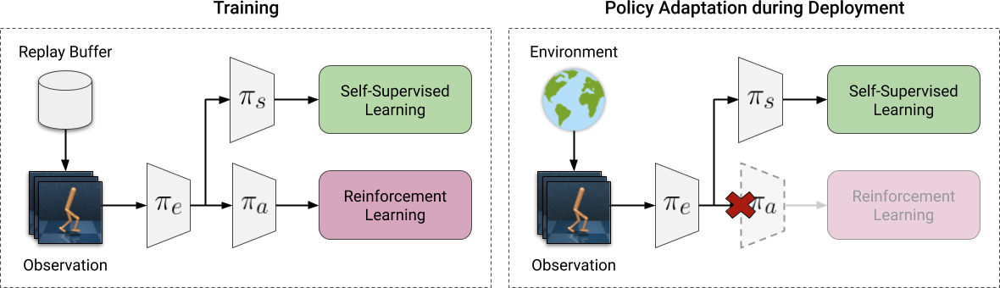

## Self-Supervised Policy Adaptation during Deployment (PAD)

In this project we exstend the work by [Hansen et al.](https://nicklashansen.github.io/) [[Paper]](https://arxiv.org/abs/2007.04309) [[Website]](https://nicklashansen.github.io/PAD/) [[Code]](https://github.com/nicklashansen/policy-adaptation-during-deployment) who show that PAD can adapt well to visual changes in the test environment given a vision-based input.

We investigate the performance of PAD when **adjusting the underlying dynamics** of the test environment instead of just visual pertubations. Additionally, we evaluate PAD on a **state vector input** instead of an image together with an according new encoder architecture.

Our results suggest that PAD can help adapt to physical changes in the test environment and also performs well given a state vector input. However, PAD also struggles to effectively adapt to certain modifications during deployment.



## Setup
First install Mujoco by unzipping it inside `~/.mujoco/` such that all Mujoco files are inside `~/.mujoco/mujoco210/`.

You also need to install GLEW for rendering to work:
```
sudo apt install libglew2.1
```

We assume that you have access to a GPU with CUDA support. All dependencies can then be installed with the following command:

```
conda env create -f environment.yml
```

All dependencies are now in an envionment called `pad`, activate it with

```
conda activate pad
```

## Added Features
We've added the option `--use_state_vector` to train and evaluate given state vector input supplied through `MuJoCo`. The encoder-block architecture is also adjusted accordingly from `Conv2D -> ReLU` to `Linear -> LayerNorm -> GeLU`.


Additionally, we've added the following new hard test environments where a physical parameter is pertubated to be both higher & lower compared to the training environment:


`cartpole_length`, `cartpole_mass`, `cartpole_size`


`cheetah_mass`, `cheetah_ground_friction`


`walker_torso_length`, `walker_ground_friction`

## Training & Evaluation
The training and evaluation scripts can be run like in the original repository with added options:

```
CUDA_VISIBLE_DEVICES=0 python3 src/train.py \
    --domain_name cheetah \
    --task_name run \
    --action_repeat 8 \
    --mode train \
    --use_inv \
    --num_shared_layers 8 \
    --seed 0 \
    --work_dir logs/cheetah_run/state_vector/ \
    --use_state_vector \
    --save_model
```
which should give you an output of the form
```
| train | E: 1 | S: 1000 | D: 0.8 s | R: 0.0000 | BR: 0.0000 | 
  ALOSS: 0.0000 | CLOSS: 0.0000 | RLOSS: 0.0000
```

To run Policy Adaptation during Deployment, call

```
CUDA_VISIBLE_DEVICES=0 python3 src/eval.py \
    --domain_name cheetah_mass \
    --task_name run \
    --action_repeat 8 \
    --mode train \
    --use_inv \
    --num_shared_layers 8 \
    --seed 0 \
    --work_dir logs/cheetah_run/state_vector/ \
    --pad_num_episodes 10 \
    --pad_checkpoint 500k \
    --use_state_vector \
    --save_video
```
which should give you an output of the form
```
Evaluating logs/cheetah_run/state_vector/ for 10 episodes (mode: cheetah_mass)
eval reward: 340

Policy Adaptation during Deployment of logs/cheetah_run/state_vector/ for 10 episodes (mode: cheetah_mass)
pad reward: 350
```

Please refer to the final report for results and experimental details.

## Acknowledgements

This project was done during the [Advanced Deep Learning for Robotics](https://bbaeuml.github.io/tum-adlr/adlr/) course at TUM.

We want to specially thank our supervisor Leon Sievers and Prof. Bäuml for their guidance.
