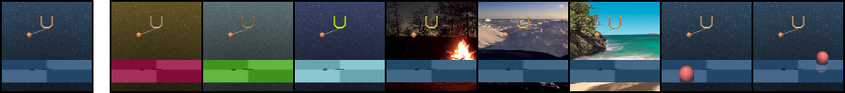

# Self-Supervised Policy Adaptation during Deployment
PyTorch implementation of PAD and evaluation benchmarks from

**Self-Supervised Policy Adaptation during Deployment**

[Nicklas Hansen](https://nicklashansen.github.io/), [Rishabh Jangir](https://jangirrishabh.github.io/), [Yu Sun](https://yueatsprograms.github.io/), [Guillem Alenyà](http://www.iri.upc.edu/people/galenya/), [Pieter Abbeel](https://people.eecs.berkeley.edu/~pabbeel/), [Alexei A. Efros](https://people.eecs.berkeley.edu/~efros/), [Lerrel Pinto](https://cs.nyu.edu/~lp91/#), [Xiaolong Wang](https://xiaolonw.github.io/)

[[Paper]](https://arxiv.org/abs/2007.04309) [[Website]](https://nicklashansen.github.io/PAD/)


## Citation
If you find our work useful in your research, please consider citing the paper as follows:

```
@article{hansen2020deployment,
  title={Self-Supervised Policy Adaptation during Deployment},
  author={Nicklas Hansen and Rishabh Jangir and Yu Sun and Guillem Alenyà and Pieter Abbeel and Alexei A. Efros and Lerrel Pinto and Xiaolong Wang},
  year={2020},
  eprint={2007.04309},
  archivePrefix={arXiv},
  primaryClass={cs.LG}
}
```

## Setup
First install Mujoco by unzipping it inside `~/.mujoco/` such that all Mujoco files are inside `~/.mujoco/Mujoco210/`.
We assume that you have access to a GPU with CUDA support. All dependencies can then be installed with the following command:

```
conda env create -f environment.yml
```

All dependencies are now in an envionment called `pad`, activate it with

```
conda activate pad
```

## Training & Evaluation
We have prepared training and evaluation scripts that can be run by `sh scripts/train.sh` and `sh scripts/eval.sh`. Alternatively, you can call the python scripts directly, e.g. for training call

```
CUDA_VISIBLE_DEVICES=0 python3 src/train.py \
    --domain_name cartpole \
    --task_name swingup \
    --action_repeat 8 \
    --mode train \
    --use_inv \
    --num_shared_layers 8 \
    --seed 0 \
    --work_dir logs/cartpole_swingup/inv/0 \
    --save_model
```
which should give you an output of the form
```
| train | E: 1 | S: 1000 | D: 0.8 s | R: 0.0000 | BR: 0.0000 | 
  ALOSS: 0.0000 | CLOSS: 0.0000 | RLOSS: 0.0000
```

We provide a pre-trained model that can be used for evaluation. To run Policy Adaptation during Deployment, call

```
CUDA_VISIBLE_DEVICES=0 python3 src/eval.py \
    --domain_name cartpole \
    --task_name swingup \
    --action_repeat 8 \
    --mode color_hard \
    --use_inv \
    --num_shared_layers 8 \
    --seed 0 \
    --work_dir logs/cartpole_swingup/inv/0 \
    --pad_checkpoint 500k
```
which should give you an output of the form
```
Evaluating logs/cartpole_swingup/inv/0 for 100 episodes (mode: color_hard)
eval reward: 666

Policy Adaptation during Deployment of logs/cartpole_swingup/inv/0 for 100 episodes (mode: color_hard)
pad reward: 722
```

Here's a few samples from the training and test environments of our benchmark:



Please refer to the project page and paper for results and experimental details.

## Acknowledgements

We want to thank the numerous researchers and engineers involved in work of which this implementation is based on.
Our SAC implementation is based on [this repository](https://github.com/denisyarats/pytorch_sac_ae), the original DeepMind Control suite is available [here](https://github.com/deepmind/dm_control) and the gym wrapper for it is available [here](https://github.com/denisyarats/dmc2gym). Go check them out!
